# lus_ios
# Ứng dụng hẹn hò, thuê người yêu
<h3> Các tính năng chính: </h3>
 + Hiển thị toàn bộ thông tin Idol: theo rating, recommed và theo khu vực  
 + Tìm kiếm Idol theo tên, khu vực, giá thuê,...  
 + Gửi tin nhắn và trò chuyện với Idol  
 + Xem bảng giá dịch vụ và đặt thuê Idol  
 + Đăng ký trở thành Idol  
 + Quản lý tình trạng các đơn hàng, hoá đơn,...  
 + Quản lý thông báo  
 
<h3> Các công nghệ sử dụng: </h3>
 + Ngôn ngữ: Swift  
 + Server: NodeJs  
 + Database: Mongodb  
 + SocketIO  
 + Login Facebook, Google  
 + Firebase Pushnotification (Đang mua tài khoản Dev)  

## Screen App
|                         |                         |                         |                         |
|        :---:            |          :---:          |        :---:            |          :---:          |
|  | 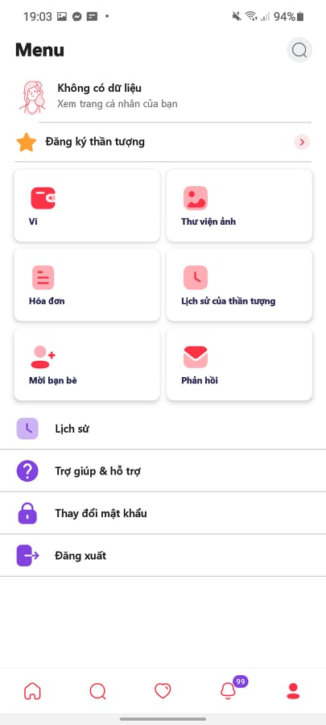 | 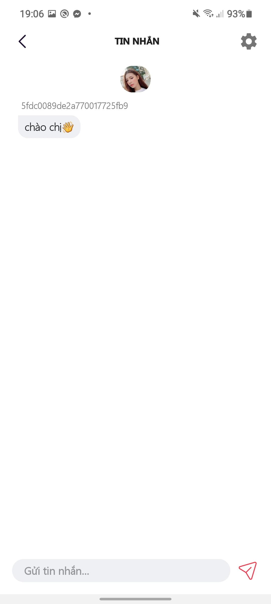 | 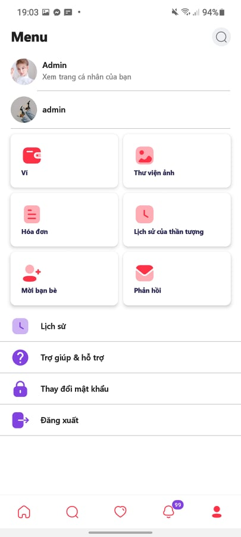 |
|  |  |  | 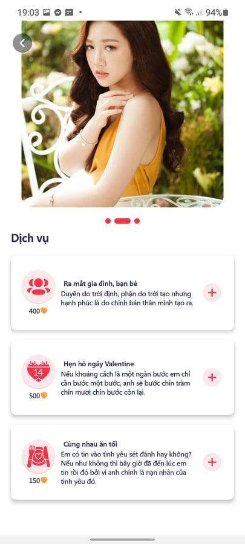 |
| 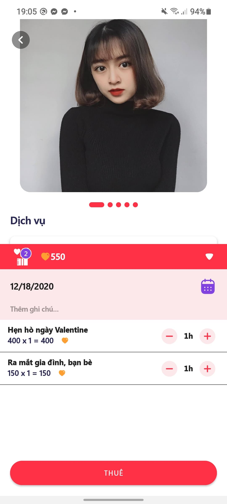 | 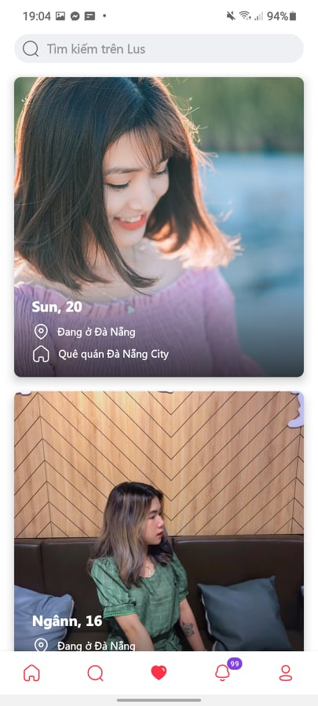 | 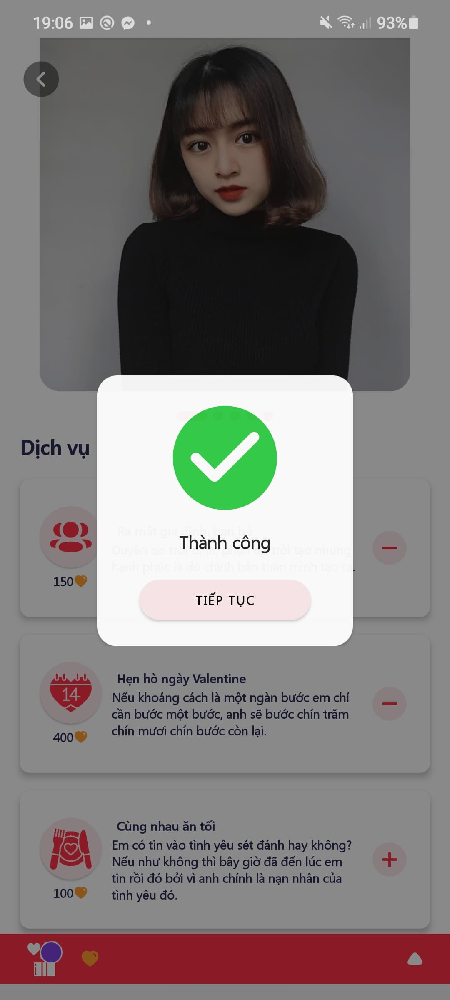 | 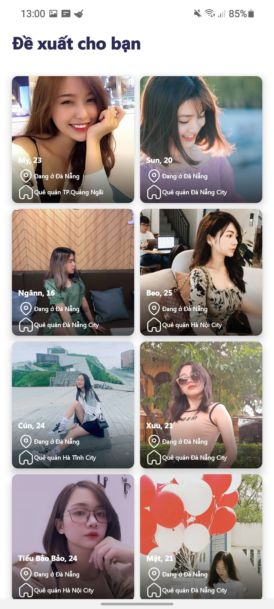 |
|  | 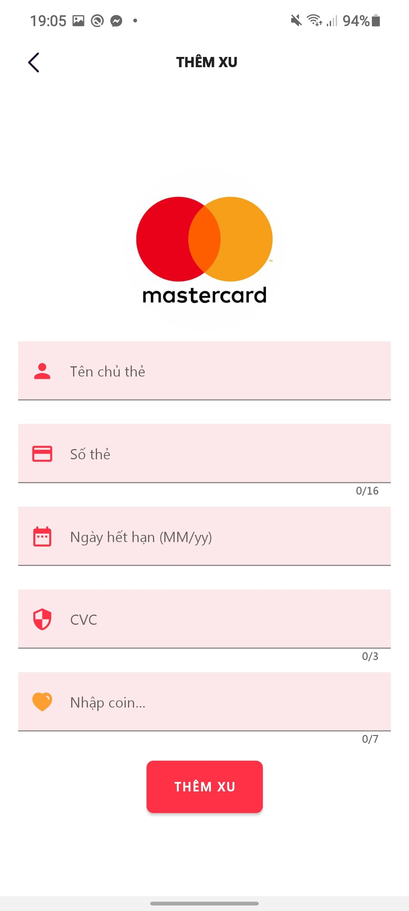 | 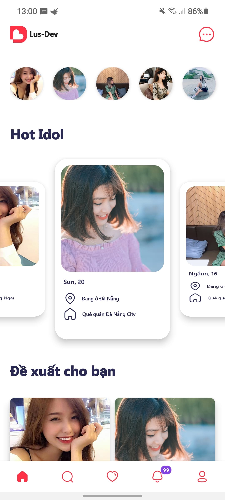 | 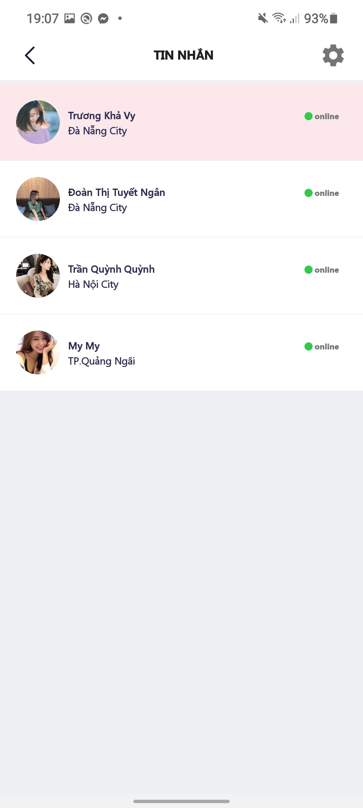 |
| 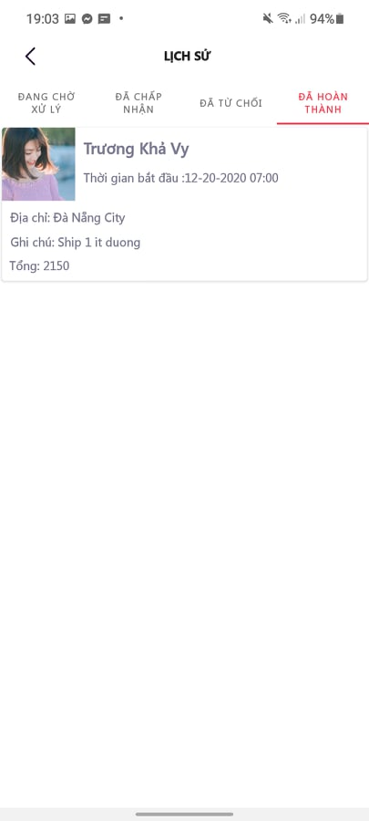
